# lab-02 实验过程

## 1. 实验准备

```shell
sudo apt-get install gcc-multilib g++-multilib

```

## 2. FAT12 文件系统简介

### 1. FAT12 文件系统结构

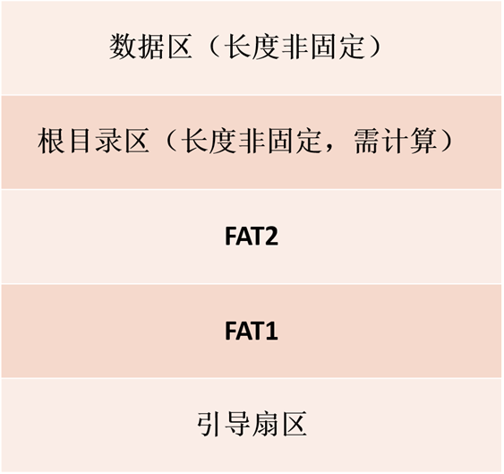

* FAT文件系统把存储介质看成一维的数组，基本单位是簇（cluster）。存储介质被划分为3个区域：boot record、FAT、directory and data area。

* 一个簇包含一个扇区，大小为512B。

| 描述     | 大小 | 占用扇区位置 | 十进制 -> 16进制            |
| -------- | ---- | ------------ | --------------------------- |
| 引导扇区 | 1    | [0, 1)       | [0, 512)  -> 0,   200       |
| FAT 表 1 | 9    | [1, 10)      | [512, 5120) -> 200, 1400    |
| FAT 表 2 | 9    | [10, 19)     | [5120, 9728) -> 1400, 2600  |
| 根目录区 | 14   | [19, 33)     | [9728, 16896) -> 2600, 4200 |
| 数据区   | ...  | [33, ...)    | [16896, ...) -> 4200, ...   |

> ```
> [a, b)
> startAddr = a * 512;
> endAddr = b * 512 - 1;
> ```

#### 1. 一段可能的 FAT 表项解读

```
00000200  f0 ff ff 00 f0 ff ff 0f  00 00 00 00 00 f0 ff 00
```
* 前三个字符为固定值 `f0 ff ff` 表示这是 FAT12 文件系统；

FAT12 表项有12位构成，即1.5个Byte，如何解读顺序就很重要：

想象为一块从上往下由低地址到高地址的排列：
```
f0 ff ff 00 f0 ff ff 0f 00 00 00 00 00 f0 ff 00
低                                           高
```
默认为高地址的值的"阶"高于地址值的值，所以排除固定的三个字符后顺序表示是：
* 从低地址到高地址，000 fff fff 000 000 000 000 fff 00；

#### 2. 根目录区

| 偏移量 | 长度 | 描述                                                       |
| ------ | ---- | ---------------------------------------------------------- |
| 0      | 8    | 文件名，文件的基本名称；未满8位填充空格 0x20               |
| 8      | 3    | 文件扩展名，'.'后面的名称；未满8位填充空格 0x20            |
| 11     | 1    | 文件属性，0x10 -> 目录，0x20 -> 普通文件，0x27 -> 隐藏文件 |
| 12     | 10   | 保留位                                                     |
| 22     | 2    | 创建时间                                                   |
| 24     | 2    | 创建日期                                                   |
| 26     | 2    | 首簇号                                                     |
| 28     | 4    | 文件大小                                                   |

由于 FAT 的前三个字节的值是固定的0xF0、0xFF、0xFF，用于表示者事一个应用在 1.44M 软盘上的 FAT12 文件系统。

本来序号为0和1的 FAT 表项应该对应于簇0和簇1，但由于这两个表现成了固定值，簇0和簇1就没有了存在的意义，因此数据区起始于簇2.

0x4200对应于簇2的起始位置；

FAT 项的值表示文件的下一个簇号；

当 FAT 项的值大于或等于0xFF8时，表示当前簇已经是本文件的最后一个簇了；

如果值为0xFF7则表示为一个坏簇；

## 3. 实现思路

因为一个 1.44M 大小的软盘总共 1474560 个字节，所以直接将软盘里所有的内容映射为一个一维的 char 数组，然后通过 char 数据构建目录/文件树，其他操作就是对目录/文件树进行搜索。

3个点：

1. 映射后，相关数据的位置如何计算？
    * 通过 FAT12 文件系统的结构，很容易得知映射数据位置的计算方式；

2. 如何构建目录/文件树？
    * 先将当前目录和当前目录下的文件/目录的局部树形结构构建，然后对当前目录下的所有子目录进行同样的操作，即递归即可。

3. 如何搜索？
    * 就是搜索树形结构，深搜/广搜。

上面的思路的一个例子：

```
# 目录/文件树
A
|-----------------B
|----------C      |----------B2
+D.TXT     |      |-----B1
           +C1.TXT
 构建过程：
 *: 表示文件，不会对他进行递归构建目录/文件树;
 -: 表示已经弹出数据结构；
 1. 构建 A 和 B，C，D.TXT 之间的属性结构:
                 A
B                C               D.TXT*
2. 依次对 B，C 递归构建目录树：
（1）现对 B 进行递归构建目录树
                   A
  B                C               D.TXT*
B1  B2

                     A
    B                C             D.TXT*
B1-   B2

                     A
    B                C             D.TXT*
B1-   B2-

此时 B1，B2 这层为空，将其弹出，然后需要将B也弹出：
                     A
    B-               C             D.TXT*
B1-   B2-
（2）对 C 进行递归构建目录树
                     A
    B-               C             D.TXT*
B1-   B2-            C1.TXT*

                     A
    B-               C-            D.TXT*
B1-   B2-            C1.TXT*
 
此时 B，C 这层为空，将其弹出，然后将 A 弹出，发现这个结构为空，终止！
```

所以，很明显，就是一个 栈 + 队列 来深搜构建目录树，伪代码表示：

```c++
stack<queue<DIR>> stk;
queue<DIR> que;
que.push(ROOTDIR);
stk.push(que);
que.pop();

while (!stk.empty()) {
    que = stk.top();
    queue<DIR> nxtQue;
    
    while (!que.empty()) {
        DIR curDir = que.top();
        for (subDir: curDir.subDirs) {
            // 构建当前目录和它的子目录的树形结构
            if (ISDIR(subDir))
                nxtQue.push(subDir);
        }
        if (!nxtQue.empty()) {
            stk.push(nxtQue);
            goto while;
        } else {
            que.pop();
        }
    }
    
    if (!stk.empty()) {
     	stk.pop();   
    }
    // 这一句是最重要的，hhh
    if (!stk.empty() && !stk.top().empty()) {
        stk.top().pop();
    }
}
```

## 4. 实验结果

### 1. TestCase1

* 主要基本功能；
* 加分项；
* 没有设计目录项超过16个(512 / 32 = 16)，即目录项不只在一个扇区(簇)。

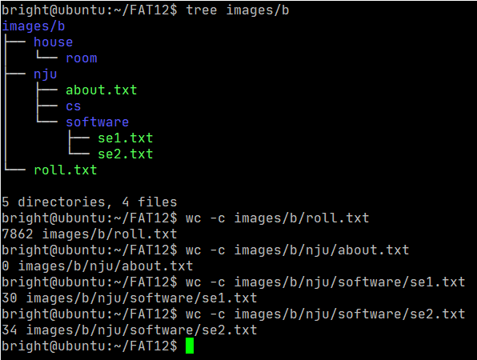

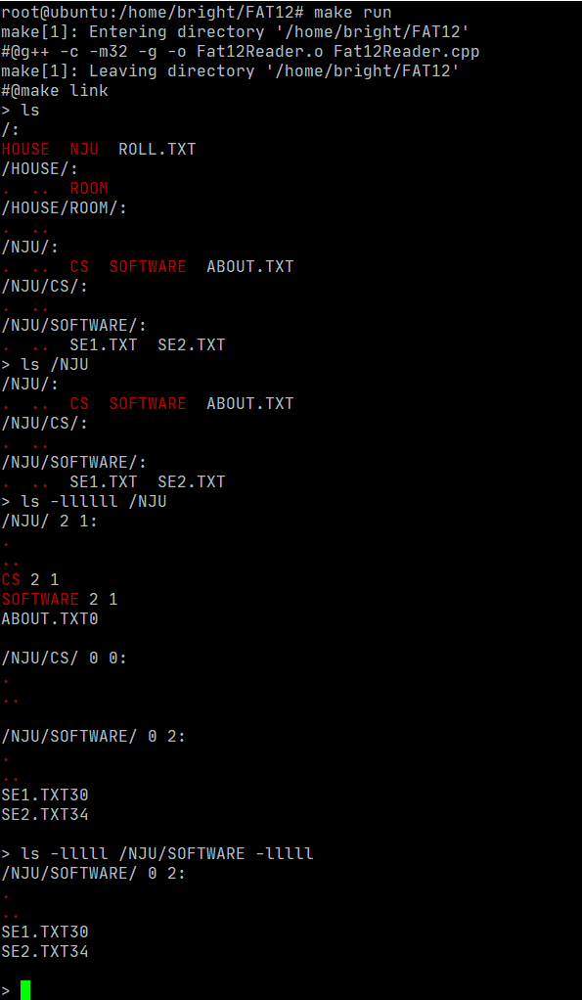

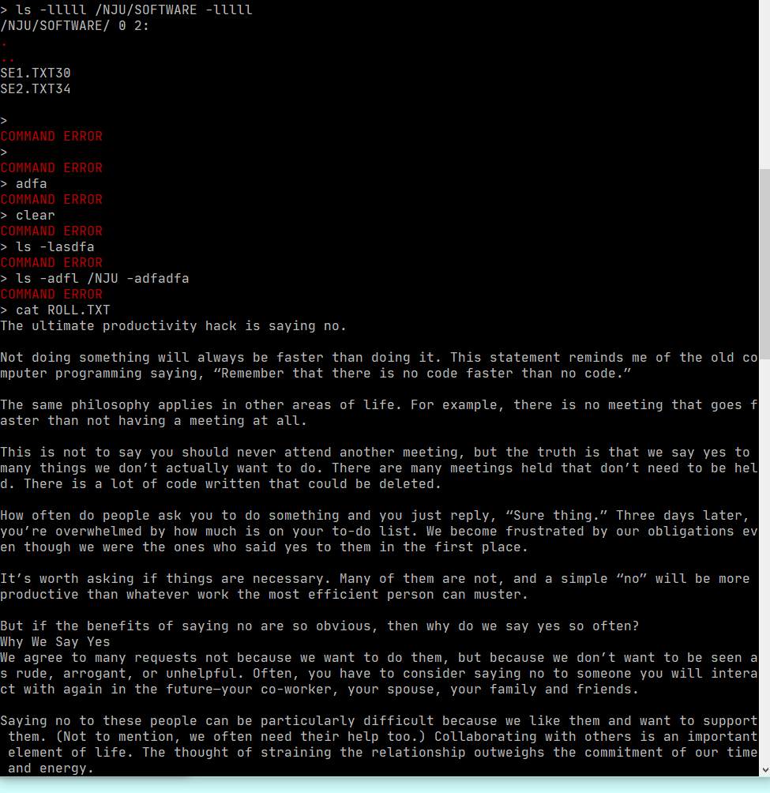

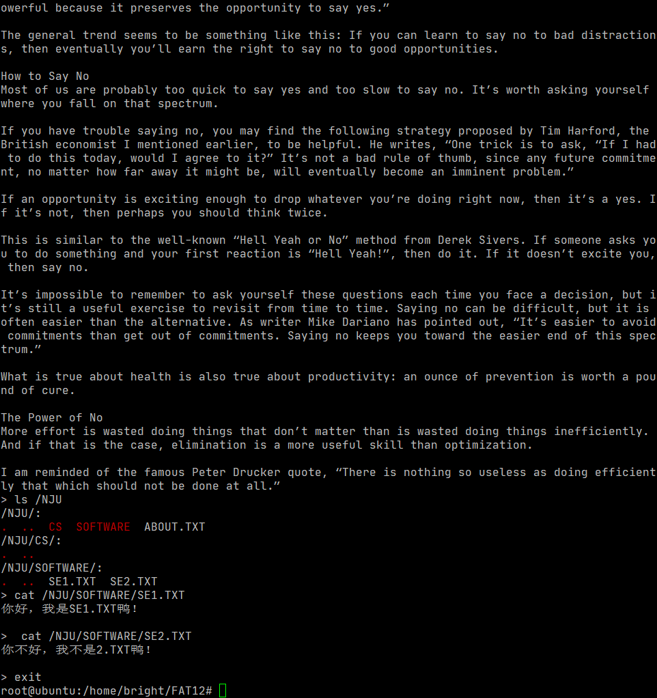

### 2. TestCase2

* 主要基本功能；
* 目录项超过 16 个(加分项)；
* 文件字符数超过 512(加分项)；

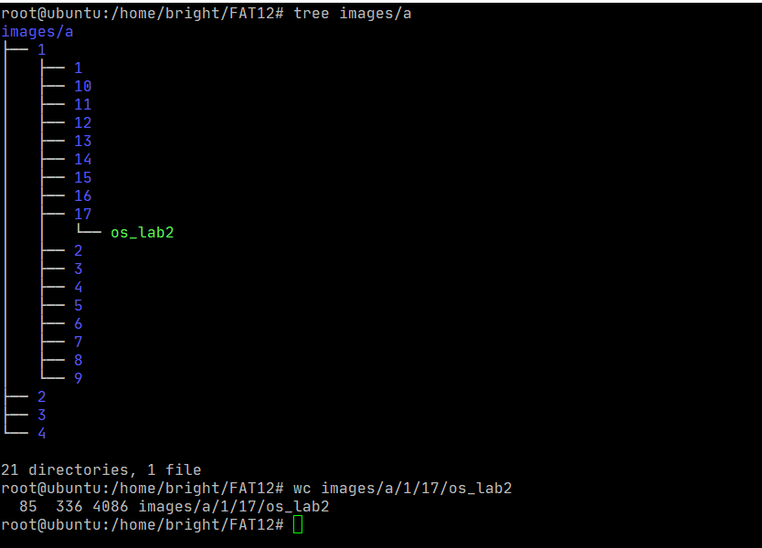

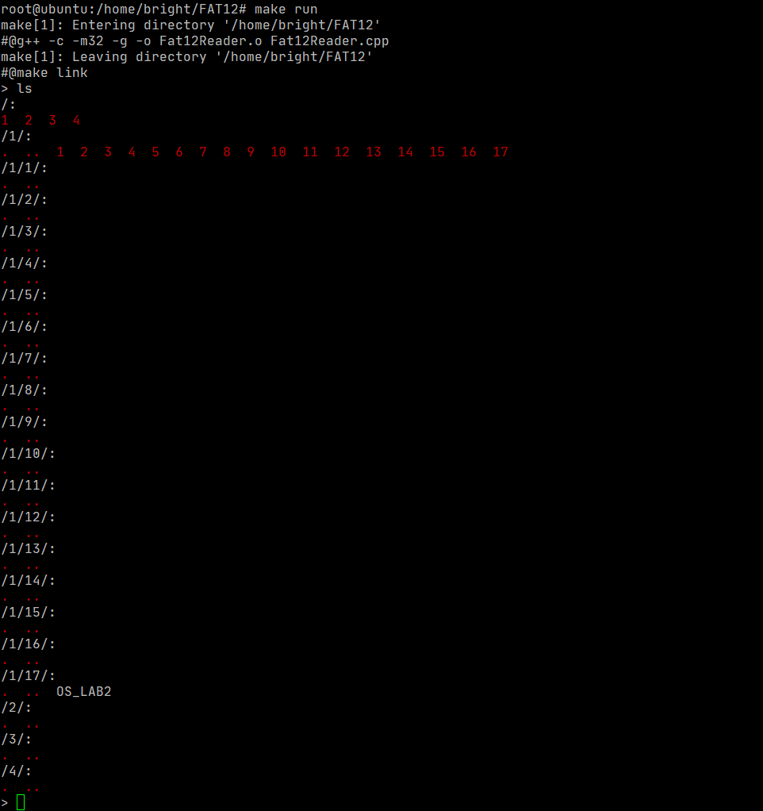

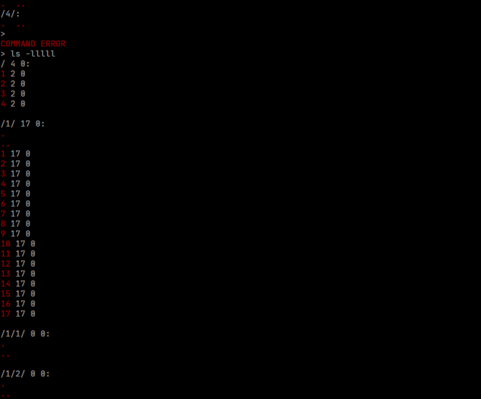

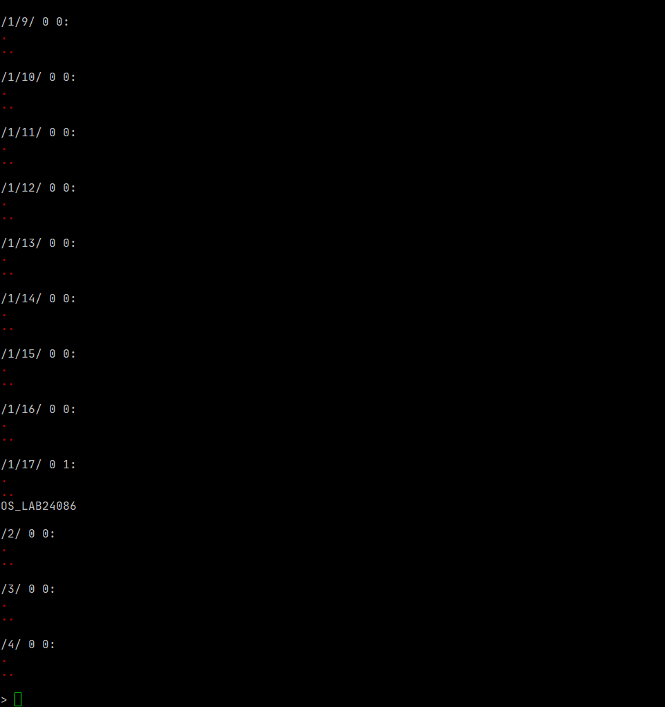

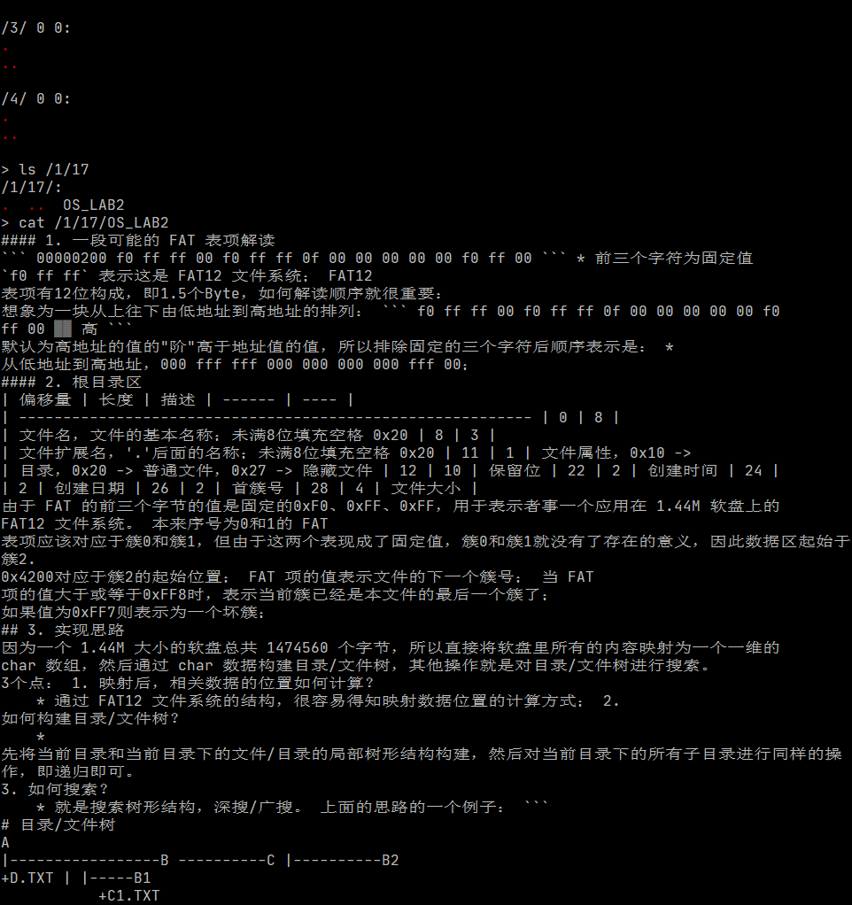

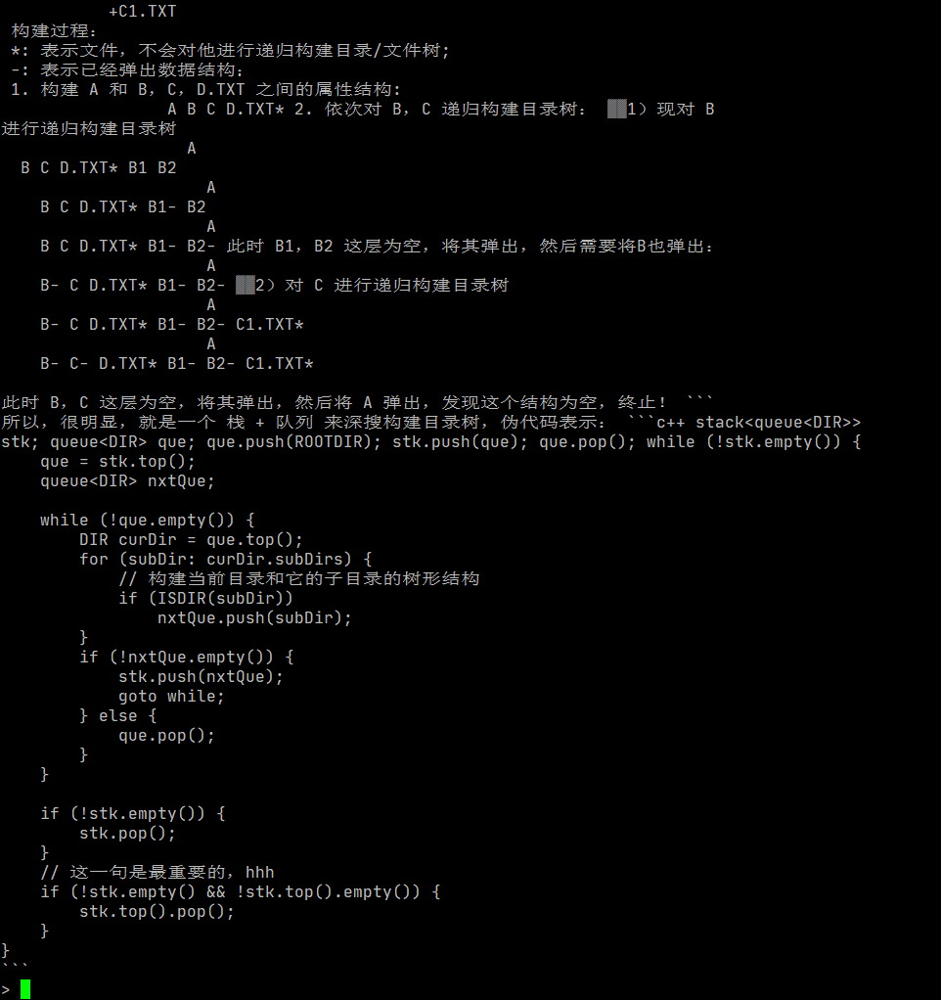

## 4. CheckLists

#### 1. 什么是实模式，什么是保护模式？

IA32 模式下，CPU 由两种工作模式：实模式和保护模式。

Intel 8086 是16位的 CPU，它有16位的寄存器，16位的数据总线，20位的地址总线，以及 1MB 的寻址能力；一个地址有段和偏移两部分组成，物理地址=段值 x 16 + 偏移，段值和偏移都是16位的。

80386 开始，Intel CPU 进入 32 位模式，有 32 位的地址线以及 4GB 的寻址能力。在32位 CPU 下，仍然使用"段 : 偏移"的寻址方式，只不过这里的段编程了一个指向某个数据结构的索引，表项定义了段的起始地址、界限、属性等内容；这个数据结构就是 GDT 或 LDT。

实模式：用基地址加偏移量就可以直接拿到物理地址的模式，缺点是不安全；

保护模式：不能直接拿到物理地址的模式，需要进行地址转换，从80386开始是现代操作系统的主要模式

#### 2. 什么是选择子？

选择子的结构：

```
[15][14][13][12][11][10][9][8][7][6][5][4][3][2][1][0]
|                   描述符索引                |TI| RPE |
```

当 TI 和 RPL 都为0，选择子就是对应描述符的相对于 GDT 基址的偏移；

* TI：表示是 GDT 还是 LDT 方式；
* RPE：表示请求特级；

#### 3. 什么是描述符？

在保护模式下引入的来描述各种数据段的二进制码，大小为8个字节，第5个字节说明描述符的类型；

详见 P52，P56.

#### 4. 什么是 GDT，什么是 LDT？

GDT：Global Descriptor Table, 其中的表项称为描述符，是全局唯一的，用来存放一些公用的描述符和包含各进程局部描述符表首地址的描述符

GDT 的作用是用来提供段式存储机制，这种机制通过段寄存器和 GDT 中的描述符共同提供。

LDT：Local Descriptor Table，局部描述符表，每个进程都可以有一个，用于存放本进程内使用的描述符；

#### 5. 请说明 GDTR 和 LDTR 的结构

GDTR的结构：[H 32位基地址 | 16位界限 L]，用于存储 GDT 的物理地址；

LDTR的结构：16位，存储 LDT 中一个描述符的选择子；

P 66.

#### 6. 请说明 GDT 直接查找物理地址的具体步骤

1. 给出段选择子+偏移量；
2. 若选择了GDT方式，则从GDTR获取GDT首地址，用段选择子中的13位做偏移，拿到GDT中的描述符；
3. 如果合法且有权限，用描述符中的段首地址+偏移量找到物理地址；

#### 7. 请说明通过 LDT 查找物理地址的具体步骤

1. 给出段选择子+偏移量；

2. 若选择了LDT方式，则从GDTR获取GDT首地址，用LDTR中的偏移量做偏移，拿到GDT中的描述符1；

3. 从描述符1中获取LDT首地址，用段选择子中的13位做偏移，拿到LDT中的描述符2；

4. 如果合法且有权限，用描述符2中的段首地址+偏移量找到物理地址；

#### 8. 根目录区大小一定嘛？扇区号是多少？为什么？

不一定，RootDirSectors = ((BPB_RootCnt*32) + (BPB_BytesPerSec-1)) / BPB_BytesPerSec.

开始的扇区号为 1.

#### 9. 数据区的第一个簇号是多少？为什么？

2，因为FAT表的0和1项始终不使用，从第二个FAT项开始表示数据区的第一个簇，为了方便表示就用2当作数据区第一个簇号是多少；

#### 10. FAT 表的作用？

用来保存包含文件簇信息的表项，与数据区中的簇构成对应关系，实现文件的链式存储。

- 大于0xFF8，说明是最后一个簇；
- 等于0xFF7，说明是坏簇；
- 其他，指明了大文件的下一个数据区所在的簇；
- 冗余，一定程度上的保护作用；


#### 11. 解释静态链接的过程
静态链接是指在编译阶段直接把静态库加入到可执行文件中去，这样可执行文件会比较大。

1. 空间与地址分配 - 扫描所有目标文件，获得各个段的长度、属性和起始地址，合并各个目标文件的符号表，得到一个全局符号表，相似段合并得到所有目标文件的段长度、位置等信息，此后的虚拟地址（函数、变量）就可以以此确定了；
2. 符号解析和重定位 - 根据全局符号表对符号的引用进行解析和重定位；符号解析就是找到符号的正确地址；重定位就是修正指令对引用其他目标文件的函数或变量的地址（未确定之前用的都是假地址），根据1中的全局符号表就能够重定位所有的符号。

#### 12. 解释动态链接的过程

动态链接是在链接阶段仅仅降入一些描述信息，等程序执行时再去系统中把相应得动态库加载到内存中区。

过程：
1. 动态链接器自举：
动态链接器本身是一个不依赖其他共享对象的共享对象，需要完成自举；

2. 装载共享对象：
将可执行文件和链接器自身的符号合并成为全局符号表，开始寻找依赖对象。加载对象的过程可以看作图的遍历过程；新的共享对象加载进来后，其符号将合并入全局符号表；加载完毕后，全局符号表将包含进动态链接所需的全部符号；

3. 重定位和初始化：
链接器遍历可执行文件和共享对象的重定位表，将它们 GOT/PLT 中的每个需要重定位的位置进行修正。完成重定位后，链接器执行 .init 段的代码，进行共享对象特有的初始化过程(如 C++ 中全局对象的构造函数)；

4. 转交控制权：
完成所有工作，将控制权转交给程序的入口开始执行。

#### 13. 静态链接相关 PPT 中为什么使用 ld 链接而不是 gcc？

用 gcc 的话有可能去调 C 库，使程序环境变得复杂，所以用 ld；gcc 会自动链接操作系统的库，有时我们并不想这么操作。ld 就老实多了，只会链接参数中所规定的。

BUT，给的 PPT 能不能将命令输对鸭？不想搞可以不搞，想搞就稍微写清楚点不行？那命令能运行吗？真的想喷人了，什么垃圾东西。

#### 14. Linux 下可执行文件的虚拟地址空间默认从哪里开始分配？

0x08048000；

#### 15. BPB 指定字段的含义

P 124.

#### 16. 如何进入子目录并输出（说明方法调用）

```c++
    stack <queue<DirOrFileEntry *>> stk;
    queue < DirOrFileEntry * > que;
    que.push(curDir);
    stk.push(que);
    string path = prefix;
    stack <string> nameStk;
    while (!stk.empty()) {
        queue < DirOrFileEntry * > curQue = stk.top();
        bool POP = true;

        while (!curQue.empty()) {
            DirOrFileEntry *curDir = curQue.front();
            queue < DirOrFileEntry * > nxtQue;
            if (strncmp(curDir->DIR_Name, "root       ", 11) == 0) {
                nameStk.push("");
                path += "/";
//                cout << path << ":" << endl;
                PRINT_WHITE(path.c_str());
                PRINT_WHITE(":\n");
            } else {
                nameStk.push(getName(*curDir));
                path += getName(*curDir) + "/";
//                printf("%s:\n", path.c_str());
                PRINT_WHITE(path.c_str());
                PRINT_WHITE(":\n");
            }
            for (DirOrFileEntry *subDir: curDir->subDir) {
                if (subDir->DIR_Attr == DIR) {
//                    cout << RED << getName(*subDir) << "  " << RESET;
                    PRINT_RED(getName(*subDir).c_str());
                    PRINT_WHITE("  ");
                    if (subDir->DIR_Attr == DIR
                        && !(strncmp(subDir->DIR_Name, ".          ", 11) == 0 ||
                             strncmp(subDir->DIR_Name, "..         ", 11) == 0)) {
                        nxtQue.push(subDir);
                    }
                } else {
//                    cout << getName(*subDir) << "  ";
                    PRINT_WHITE(getName(*subDir).c_str());
                    PRINT_WHITE("  ");
                }
            }
//            cout << endl;
            PRINT_WHITE("\n");
            if (!nxtQue.empty()) {
                stk.push(nxtQue);
                POP = false;
                break;
            } else {
                curQue.pop();
                path = path.size() == 0 ? path : path.substr(0, (path.size() - nameStk.top().size() - 1));
                if (!nameStk.empty())
                    nameStk.pop();
            }
        }
        if (POP) {
            stk.pop();
            if (!stk.empty() && !stk.top().empty())
                stk.top().pop();
            //path = path.size() == 0 ? path : path.substr(0, (path.size() - nameStk.top().size() - 1));
            path = path.size() == 0 ? path : path.substr(0,
                                                         (path.size() - (nameStk.empty() ? 0 : nameStk.top().size()) -
                                                          1));
            if (!nameStk.empty())
                nameStk.pop();
        }
    }
```

* 因为我构建了目录树，直接搜索树就好了。

#### 17. 如何获得指定文件的内容，即如何获得数据区的内容（比如使用指针等）

```c++
    if (clus == 0xff7) {
        PRINT_RED("CLUS ERROR\n");
    } else if (clus >= 0xff8) {
        return;
    }
    int start = DataStart + 0x200 * (clus - 2);
    if (size >= 512) {
        for (int i = start; i < start + 512; i++) {
//            printf("%c", (char) IMG[i]);
            string c;
            c += (char) IMG[i];
            PRINT_WHITE(c.c_str());
        }
        size -= 512;
        clus = getNextClus(clus);
        cat(clus, size);
    } else {
        for (int i = start; i < start + size; i++) {
//            printf("%c", IMG[i]);
            string c;
            c += (char) IMG[i];
            PRINT_WHITE(c.c_str());
        }
    }
```

* 因为我们知道数据区的起始位置，然后知道文件的起始簇号，直接读就好了。

#### 18. 如何进行 C 代码和汇编之间的参数传递和返回值传递

```c++
extern "C" {
void PRINT_RED(const char *);
void PRINT_WHITE(const char *);
}
```

在我的代码中没有进行返回值传递，进行了参数传递。

调用函数会压栈，然后参数也是通过栈传递的，当我调用这些函数时，实际就是往栈里压入了一个 const char * 参数，32位4个字节，所以读取的时候为 [esp + 4];

#### 19. 汇编代码中对 I/O 的处理方式，说明指定寄存其所存值得含义

```assembly
section .data
RED:			db 1bh, "[31m", 0
RESET:          db 1bh, "[0m", 0

section .text
	global PRINT_RED
	global PRINT_WHITE

PRINT_RED:
    mov eax, RED

    call sprint
    mov eax, [esp+4]
    call sprint

    mov eax, RESET
    call sprint
    ret

PRINT_WHITE:
    mov eax, [esp+4]
    call sprint
    ret

;向标准输出输出字符串的内容，并输出换行符
;默认字符串首地址存放在eax
sprintln:
    call    sprint

    push    eax
    mov eax, 0Ah
    push    eax
    mov eax, esp
    call    sprint
    pop eax
    pop eax
    ret

;向标准输出输出字符串
;默认字符串首地址存放在eax
sprint:
    push    edx
    push    ecx
    push    ebx
    push    eax
    call    strlen

    mov edx, eax
    pop eax

    mov ecx, eax
    mov ebx, 1
    mov eax, 4
    int 80h

    pop ebx
    pop ecx
    pop edx
    ret

;计算字符串长度
;默认字符串首地址存放在eax
strlen:
    push    ebx
    mov ebx, eax

nextchar:
    cmp byte[eax], 0
    jz  finished
    inc eax
    jmp nextchar

finished:
    sub eax, ebx
    pop ebx
    ret

```

* 其他的第一次作业都讲过了，就 esp 嘛，运行栈，往里面传递参数。

## 5. 参考

* [FAT12文件系统介绍](https://zhuanlan.zhihu.com/p/121807427)
* [详解FAT12文件系统](https://blog.csdn.net/qq_39654127/article/details/88429461#main-toc)